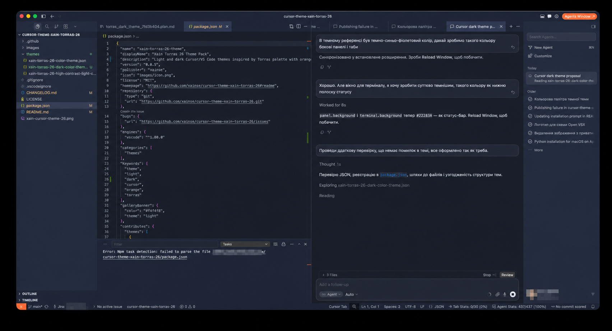
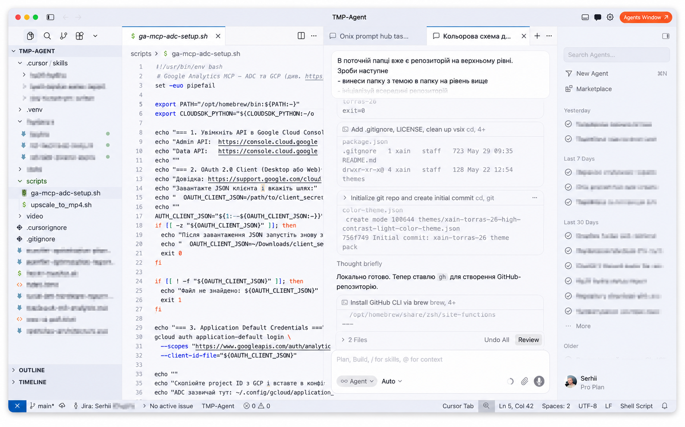

# XAIN Torras 26 Theme Pack

[](https://github.com/xainse/cursor-theme-xain-torras-26/actions/workflows/publish.yml?query=event%3Apush)
[](https://github.com/xainse/cursor-theme-xain-torras-26/releases)
[](https://open-vsx.org/extension/xainse/xain-torras-26-theme)
[](https://open-vsx.org/extension/xainse/xain-torras-26-theme)
[](https://open-vsx.org/extension/xainse/xain-torras-26-theme/reviews)
[](https://github.com/xainse/cursor-theme-xain-torras-26/stargazers)
[](https://code.visualstudio.com/)
[](https://cursor.com/)
[](./LICENSE)
[](https://github.com/xainse/cursor-theme-xain-torras-26/commits/main)

Light and dark themes for Cursor/VS Code based on the `xain-torras-26` palette.

## Preview



## Included themes

- `xain-torras-26` (light, default)
- `xain-torras-26 Dark` (dark)
- `xain-torras-26 High Contrast Light`

## Install via Cursor Agent (one-click prompt)

Open Cursor, start a new chat, and paste the prompt below. The agent will install the theme from [Open VSX](https://open-vsx.org/extension/xainse/xain-torras-26-theme) and activate it for you.

````markdown
Install the "Xain Torras 26" Cursor color theme from Open VSX and activate it.

Extension id:    `xainse.xain-torras-26-theme`
Open VSX page:   https://open-vsx.org/extension/xainse/xain-torras-26-theme
Theme labels:
- `xain-torras-26`                       (default, light)
- `xain-torras-26 Dark`                  (dark)
- `xain-torras-26 High Contrast Light`

Goal: end-to-end, no manual UI steps unless EVERY automatic path below has
failed. Pick the route with the fewest confirmations and just do it.

## PATH A — Direct VSIX install (preferred; no `cursor` CLI needed)

This works even if the Cursor CLI is missing or sandboxed.

- **A1.** Resolve latest version + download URL:
  - `GET https://open-vsx.org/api/xainse/xain-torras-26-theme/latest`
  - Read `.version` and `.files.download` from the JSON.
- **A2.** Download the `.vsix` to `/tmp` (`curl -L --fail`).
- **A3.** Extract it (it's a zip). Inside there is an `extension/` folder.
  Move that folder's contents to:
  `~/.cursor/extensions/xainse.xain-torras-26-theme-<version>/`
  Overwrite if the dir already exists.
- **A4.** Update `~/.cursor/extensions/extensions.json`:
  - It's a JSON array of installed-extension records.
  - Remove any existing entry whose `identifier.id` equals
    `xainse.xain-torras-26-theme` (case-insensitive).
  - Append a new record built from the vsix's `package.json` + the target
    install dir. Fields:
    - `identifier.id`, `identifier.uuid` (if present)
    - `version`
    - `location.$mid = 1`, `location.path`, `location.scheme = "file"`
    - `relativeLocation`
    - `metadata`: `installedTimestamp`, `source = "gallery"`, `id`,
      `publisherId`, `publisherDisplayName`,
      `targetPlatform = "undefined"`, `updated = false`,
      `isPreReleaseVersion = false`, `hasPreReleaseVersion = false`
  - Preserve all other entries and the file's existing formatting/order.
- **A5.** Update Cursor user `settings.json` (path below) — set:
  `"workbench.colorTheme": "xain-torras-26"`
  JSONC-safe: preserve every other key, comment, and trailing comma.
  Create the file as `{}` if missing.

If any of A1–A4 fails (network blocked, zip malformed, etc.), fall through
to PATH B. Print the failing command + stderr before falling through.

## PATH B — CLI install (fallback)

- **B1.** Make sure `cursor` is callable. In order:
  - **a)** If `command -v cursor` succeeds → use it.
  - **b)** Otherwise, locate the bundled binary:
    - macOS:   `/Applications/Cursor.app/Contents/Resources/app/bin/cursor`
    - Linux:   `/opt/Cursor/bin/cursor`,
      `/usr/share/cursor/bin/cursor`,
      `/usr/bin/cursor`,
      `~/.local/share/cursor/bin/cursor`
    - Windows: `%LOCALAPPDATA%\Programs\cursor\resources\app\bin\cursor.cmd`

    If found, symlink it into the FIRST writable directory on the current
    `$PATH`, tried in this order:
    `/opt/homebrew/bin`, `/usr/local/bin`, `~/.local/bin`.
    Do **NOT** use `sudo`. If `~/.local/bin` is not on PATH, create it, add
    the symlink, and echo the one-line `export` the user can paste into
    `~/.zshrc` or `~/.bashrc`.
  - **c)** If the binary cannot be found anywhere → Cursor is not installed
    (or installed in an unknown location). Only in this single case:
    ask the user to enable the CLI via
    `Cmd/Ctrl+Shift+P` → **Shell Command: Install 'cursor' command in PATH**
    and stop.

- **B2.** Install:

  ```bash
  cursor --install-extension xainse.xain-torras-26-theme --force
  ```

  If it fails with `EPERM: operation not permitted, mkdir '…/Cursor/logs/…'`
  that's the agent sandbox — rerun the SAME command outside the sandbox /
  with elevated FS permissions. Do **not** treat the first `EPERM` as a
  registry failure.

- **B3.** Do step **A5** (settings.json).

## settings.json location

- macOS:   `~/Library/Application Support/Cursor/User/settings.json`
- Linux:   `~/.config/Cursor/User/settings.json`
- Windows: `%APPDATA%\Cursor\User\settings.json`

## Output

Print exactly:

- Which path was used (A or B) and one-line reason.
- Extension id + installed version (from
  `cursor --list-extensions --show-versions` if CLI is available, otherwise
  from the vsix's `package.json`).
- Active theme name.
- One final line:
  > Fully quit and reopen Cursor, OR press `Cmd/Ctrl+Shift+P` →
  > **Developer: Reload Window** to apply.
````

## Local test

1. Open this folder in Cursor/VS Code.
2. Press `F5` to run Extension Development Host.
3. Select one of the themes from `Preferences: Color Theme`.

## Publish to Cursor ecosystem (Open VSX)

Cursor installs extensions from Open VSX.

### Automated release (recommended)

Releases are published automatically by [`.github/workflows/publish.yml`](.github/workflows/publish.yml) when a `v*.*.*` tag is pushed. The workflow packages the `.vsix`, publishes it to Open VSX and attaches the artifact to a GitHub Release.

One-time setup:

1. Create a Personal Access Token on [open-vsx.org](https://open-vsx.org/user-settings/tokens).
2. In the repo go to **Settings → Secrets and variables → Actions → New repository secret** and add:
   - Name: `OVSX_PAT`
   - Value: your Open VSX token

Cutting a release:

```bash
npm version patch   # or minor / major — bumps package.json and creates a tag
git push --follow-tags
```

You can also trigger the workflow manually from the **Actions** tab (use the `dry_run` input to only build the `.vsix` without publishing).

### Manual publish

```bash
npx ovsx publish -p <OPEN_VSX_TOKEN>
```

## Optional: Publish to VS Code Marketplace

```bash
npx @vscode/vsce publish
```

## Light theme preview


